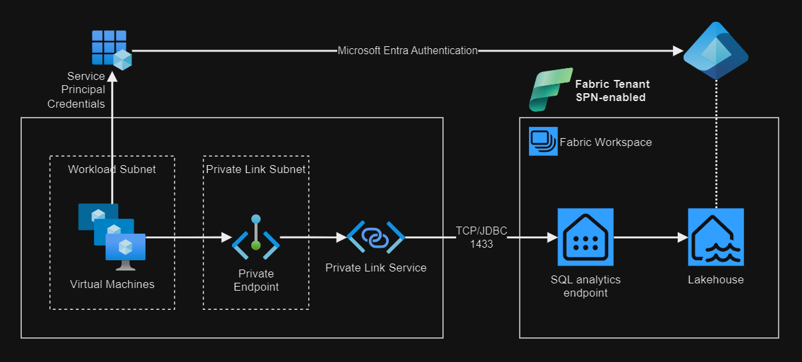

# Microsoft Fabric - Private Link

Running queries in Fabric Lakehouse using SQL endpoints via Private Link.



## 1 - Fabric environment

> [!TIP]
> The following licenses are required: **Power BI license**, **Microsoft Fabric**, **Microsoft 365**

### Base project

A Fabric environment is required for this project. For demonstration purposes, you can use [Lakehouse Tutorial][4].

## 2 - Create the Azure infrastructure

### Setup

Generate the `.auto.tfvars` from the [template](config/template.tfvars):

```sh
cp config/template.tfvars
```

Set your public IP address in the `allowed_source_address_prefixes` variable using CIDR notation:

```sh
# allowed_source_address_prefixes = ["1.2.3.4/32"]
curl ipinfo.io/ip
```

Create a temporary key for the Virtual Machine:

```sh
mkdir keys && ssh-keygen -f keys/temp_rsa
```

Deploy the resources:

```sh
terraform init
terraform apply -auto-approve
```

Run the verifications in the next section.

### Verification

> [!TIP]
> The cloud init script will `reboot` the machine after completion.

Start an SSH session in the VM:

```sh
ssh -i keys/temp_rsa.pub azureuser@<public-ip>
```

Check if the initialization script finished successfully:

```sh
cloud-init status --wait
```

Check for the required packages installation:

```sh
sudo az version
sudo docker run hello-world
```

## 3 - Set up Fabric Private Link

### Enable Private Link in Fabric

In the Fabric Admin portal, set the Fabric tenant to use [Azure Private link][1]. The SQL endpoint will have the same public name via Private Link, only resolving to a private IP within Azure later. Example:

```
<object-id>.datawarehouse.fabric.microsoft.com
```

### Enable Service Principals

Also in the Admin portal, [enable service principals][5].

### 

### Fabric Capacity

> [!WARNING]
> Fabric Capacity can incur high costs.

In order to use Private Link, purchasing paid Fabric Capacity [is required][1].

To create the Fabric Capacity via Terraform, enable it in the configuration:

```terraform
create_fabric_capacity = true
```

It is also possible to do it via the [Azure Portal][3].

After purchasing Fabric Capacity, **assign the capacity to the workspace**.

### Create the Private Link Service

> [!IMPORTANT]
> Azure Private Link resources for Fabric described in this section must be created **after the Fabric Capacity has been associated with the workspace**. If not, port 1433 will not resolve. To fix it, simply delete and recreate the Private Link service and endpoints associated with Fabric.

After Private Link is enabled in the tenant, and the Fabric capacity is assigned to the workspace, create the Private Link resources in Azure.

Enable the flag:

```terraform
create_fabric_private_link = true
```

Apply the configuration:

```sh
terraform apply
```

### Private Link verification

From the Virtual Machine in Azure, confirm that the Fabric endpoints are resolving to private IPs:

> [!NOTE]
> Make sure that the Fabric endpoints are resolving to private CIDRs (E.g.: 10.x.x.x)

```sh
dig +short app.fabric.microsoft.com
dig +short onelake.dfs.fabric.microsoft.com
dig +short <tenant-object-id-without-hyphens>-api.privatelink.analysis.windows.net
```

## 4 - Application configuration

###  ACR build & push

Build and push the application image to Azure.

In your local environment, set the ACR name:

```sh
export CONTAINER_REGISTRY="<acr name>"
```

Build and push the image to the Container Registry repository:

```sh
(cd ./app; bash ./acrBuildPush.sh)
```

### Running in Azure

Login using the VM system-assigned managed identity:

> ![TIP]
> You must login with `sudo` to allow the ACR login.

```sh
sudo az login --identity
```

Set the registry name as a variable:

```sh
registry="<acrname>"
```

Login to the registry:

```sh
az acr login --name $registry
```

Pull the image from the ACR repository:

```sh
sudo docker pull $registry.azurecr.io/fabricapp:latest
```

Create an environments file `fabric.env` file and set the appropriate values in the placeholders:

- SQL Endpoint name
- `database`
- `aadSecurePrincipalId`
- `aadSecurePrincipalSecret`

Contents of the `fabric.env` file:

```bash
FABRIC_JDBC_CONNECTION_URL="jdbc:sqlserver://<SQLENDPOINT>.datawarehouse.fabric.microsoft.com:1433;database=<DATABASE>;authentication=ActiveDirectoryServicePrincipal;aadSecurePrincipalId=****;aadSecurePrincipalSecret==****;encrypt=true;trustServerCertificate=false;"
```

Create the `compose.yml`. Replace the `<registry>` placeholder with the container registry name:

```yaml
services:
  fabric-app:
    image: <registry>.azurecr.io/fabricapp:latest
    env_file: "fabric.env"
    ports:
      - "8080:8080"
```

Run the application:

```sh
sudo docker compose up
```

Call the endpoint:

```sh
curl http://<vmip>:8080/api/fabric/select1
```

## Connect

https://learn.microsoft.com/en-us/fabric/security/security-managed-private-endpoints-create


SQL analytics endpoint

m26bvs4vdluubiodgfvs7sj4bu-m6d5xj5dylcunhnik6jsdwtxte.datawarehouse.fabric.microsoft.com


## Local development

Start the local database:

```sh
docker run -e "ACCEPT_EULA=Y" -e "MSSQL_SA_PASSWORD=Str0ngP4ssword#2023" --name mssql-dev -p 1433:1433 -d mcr.microsoft.com/mssql/server
```

Start the application:

```sh
./mvnw spring-boot:run -Dspring-boot.run.profiles=local
```


https://learn.microsoft.com/en-us/fabric/get-started/fabric-trial
https://learn.microsoft.com/en-us/fabric/get-started/fabric-trial#other-ways-to-start-a-microsoft-fabric-trial


https://learn.microsoft.com/en-us/fabric/security/security-managed-vnets-fabric-overview
https://learn.microsoft.com/en-us/fabric/data-warehouse/entra-id-authentication
https://learn.microsoft.com/en-us/fabric/data-warehouse/entra-id-authentication


[1]: https://learn.microsoft.com/en-us/fabric/security/security-private-links-overview#other-considerations-and-limitations
[2]: https://learn.microsoft.com/en-us/fabric/security/security-private-links-use
[3]: https://portal.azure.com/#create/Microsoft.Fabric
[4]: https://learn.microsoft.com/en-us/fabric/data-engineering/tutorial-lakehouse-introduction
[5]: https://learn.microsoft.com/en-us/fabric/data-warehouse/entra-id-authentication
