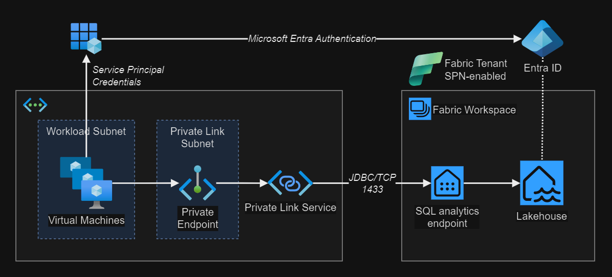

# Microsoft Fabric - Private Link

Running queries in Fabric Lakehouse using SQL endpoints via Private Link.



## 1 - Fabric environment

> [!TIP]
> The following licenses are required: **Power BI license**, **Microsoft Fabric**, **Microsoft 365**

### Base project

A Fabric environment is required for this project. For demonstration purposes, you can use [Lakehouse Tutorial][4].

## 2 - Create the Azure infrastructure

### Setup

Generate the `.auto.tfvars` from the [template](config/template.tfvars):

```sh
cp config/template.tfvars
```

Set your public IP address in the `allowed_source_address_prefixes` variable using CIDR notation:

```sh
# allowed_source_address_prefixes = ["1.2.3.4/32"]
curl ipinfo.io/ip
```

Create a temporary key for the Virtual Machine:

```sh
mkdir keys && ssh-keygen -f keys/temp_rsa
```

Deploy the resources:

```sh
terraform init
terraform apply -auto-approve
```

Run the verifications in the next section.

### Verification

> [!TIP]
> The cloud init script will `reboot` the machine after completion.

Start an SSH session in the VM:

```sh
ssh -i keys/temp_rsa.pub azureuser@<public-ip>
```

Check if the initialization script finished successfully:

```sh
cloud-init status --wait
```

Check for the required packages installation:

```sh
sudo az version
sudo docker run hello-world
```

## 3 - Set up Fabric Private Link

### Enable Private Link in Fabric

In the Fabric Admin portal, set the Fabric tenant to use [Azure Private link][1]. The SQL endpoint will have the same public name via Private Link, only resolving to a private IP within Azure later. Example:

```
<object-id>.datawarehouse.fabric.microsoft.com
```

### Enable Service Principals

Also in the Admin portal, [enable service principals][5].

### Service principal permissions

An App Registration named `litwware123-fabricapp` would have been created by Terraform.

In the Lakehouse permissions management, assign `Read` access to SQL endpoints.

### Fabric Capacity

> [!WARNING]
> Fabric Capacity can incur high costs.

#### Create the capacity

In order to use Private Link, purchasing paid Fabric Capacity [is required][1].

To create the Fabric Capacity via Terraform, enable it in the configuration:

```terraform
create_fabric_capacity = true
```

Alternatively, it's possible to do it via the [Azure Portal][3].

#### Assign the capacity

After purchasing Fabric Capacity, **assign the capacity to the workspace**.

### Create the Private Link Service

> [!IMPORTANT]
> Azure Private Link resources for Fabric described in this section must be created **after the Fabric Capacity has been associated with the workspace**. If not, port 1433 will not resolve. To fix it, simply delete and recreate the Private Link service and endpoints associated with Fabric.

After Private Link is enabled in the tenant, and the Fabric capacity is assigned to the workspace, create the Private Link resources in Azure.

Enable the flag:

```terraform
create_fabric_private_link = true
```

Apply the configuration:

```sh
terraform apply
```

### Private Link verification

From the Virtual Machine in Azure, confirm that the Fabric endpoints are resolving to private IPs:

> [!NOTE]
> Make sure that the Fabric endpoints are resolving to private CIDRs (E.g.: 10.x.x.x)

```sh
dig +short app.fabric.microsoft.com
dig +short onelake.dfs.fabric.microsoft.com
dig +short <tenant-object-id-without-hyphens>-api.privatelink.analysis.windows.net
```

## 4 - Execute the Fabric client application

###  Build the application

Build and push the application image to Azure Container Registry.

In your local environment, set the ACR name:

```sh
export CONTAINER_REGISTRY="<acr name>"
```

Build and push the image to the Container Registry repository:

```sh
(cd ./app; bash ./acrBuildPush.sh)
```

### Running in Azure

While connected with SSH in the Azure VM, login with the CLI using the VM system-assigned managed identity:

> [!IMPORTANT]
> You must login with `sudo` to allow the ACR login later.

```sh
sudo az login --identity
```

Set the registry name as a session variable:

```sh
registry="<acrname>"
```

Login to the registry:

```sh
sudo az acr login --name $registry
```

Pull the image from the ACR repository:

```sh
sudo docker pull $registry.azurecr.io/fabricapp:latest
```

Create the environments file:

```sh
touch fabric.env
nano fabric.env
```

Set the JDBC connection URL environment variable:

```sh
FABRIC_JDBC_CONNECTION_URL="jdbc:sqlserver://<SQLENDPOINT>.datawarehouse.fabric.microsoft.com:1433;database=<DATABASE>;authentication=ActiveDirectoryServicePrincipal;aadSecurePrincipalId=****;aadSecurePrincipalSecret==****;encrypt=true;trustServerCertificate=false;"
```

Replace the appropriate placeholder values in the connection string:

| Variable | Notes |
|-|-|
| SQL endpoint name | Get this name from the Lakehouse SQL analytical endpoint. |
| `database` | This is the Lakehouse database name. |
| `aadSecurePrincipalId` | The App Registration application ID created by Terraform. |
| `aadSecurePrincipalSecret` | Manually create this secret and replace in the connection string. |

Create the compose file:

```sh
touch compose.yml
nano compose.yml
```

Past the content below. Replace the `<registry>` placeholder with the container registry name:

```yaml
services:
  fabric-app:
    image: <registry>.azurecr.io/fabricapp:latest
    env_file: "fabric.env"
    ports:
      - "8080:8080"
```

Start the application:

```sh
sudo docker compose up
```

Call the endpoint:

```sh
curl http://<vmip>:8080/api/fabric/select1
```

## Local development

Start the local database:

```sh
docker run -e "ACCEPT_EULA=Y" -e "MSSQL_SA_PASSWORD=Str0ngP4ssword#2023" --name mssql-dev -p 1433:1433 -d mcr.microsoft.com/mssql/server
```

Start the application:

```sh
./mvnw spring-boot:run -Dspring-boot.run.profiles=local
```

[1]: https://learn.microsoft.com/en-us/fabric/security/security-private-links-overview#other-considerations-and-limitations
[2]: https://learn.microsoft.com/en-us/fabric/security/security-private-links-use
[3]: https://portal.azure.com/#create/Microsoft.Fabric
[4]: https://learn.microsoft.com/en-us/fabric/data-engineering/tutorial-lakehouse-introduction
[5]: https://learn.microsoft.com/en-us/fabric/data-warehouse/entra-id-authentication
